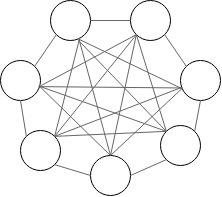

# Hopfield networks

Hopfield networks explained and demonstrated. 

## This is part 4 of a series of github repos on neural networks

- [part 1 - simplest network](https://github.com/gokadin/ai-simplest-network)
- [part 2 - backpropagation](https://github.com/gokadin/ai-backpropagation)
- [part 3 - backpropagation-continued](https://github.com/gokadin/ai-backpropagation-continued)
- part 4 - hopfield-networks (**you are here**)

## Table of Contents-

- [Theory](#theory)
  - [A different type of network](#a-different-type-of-network)
  - [Learning](#learning)
- [Code example](#code-example)
- [References](#references)

## Theory

### A different type of network

Hopfield networks are are a type of artificial neural networks that have fully interconnected nodes as opposed to layers. In the case of the image below, there are 7 nodes each connected to 6 other nodes with outgoing and incoming weight values. This mearns that each node is both an input and an output of the network. 

Hopfield networks and Boltzmann machines are known as energy based networks, meaning they are associating a scalar energy to each configuration of variables. 

Its main use is to learn an association between an input and output and recall the learned pattern based on a corrupted, partial or noisy input. 

If $K$ is the total number of nodes, then the input to each node $x_j$ is the sum of other node outputs $y_i$ times their corresponding weights $w_{ij}$ minus the bias unit $b_j$. 

$$ x_j = \sum^K_{i = 1}w_{ij}y_j - b_j $$

As we did in *part 2 and 3*, if we count the bias node as a regular input to a node, then we can simplify the equation:

$$ x_j = \sum^{K + 1}_{i = 1}w_{ij}y_j $$

Hopfield network node outputs are binary (we'll use $+1$ and $-1$) and make use of an activation function $f$ that transforms their input to either $+1$ if $x_j \geq 0$ and $-1$ if $x_j \leq 0$. 

### Learning

🚧UNDER CONSTRUCTION🚧

## Code example

🚧UNDER CONSTRUCTION🚧

## References

- Artificial intelligence engines by James V Stone (2019)